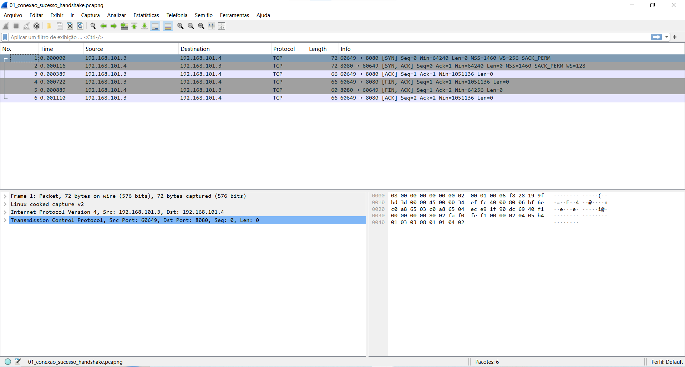
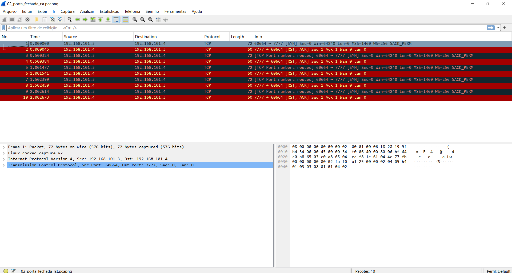
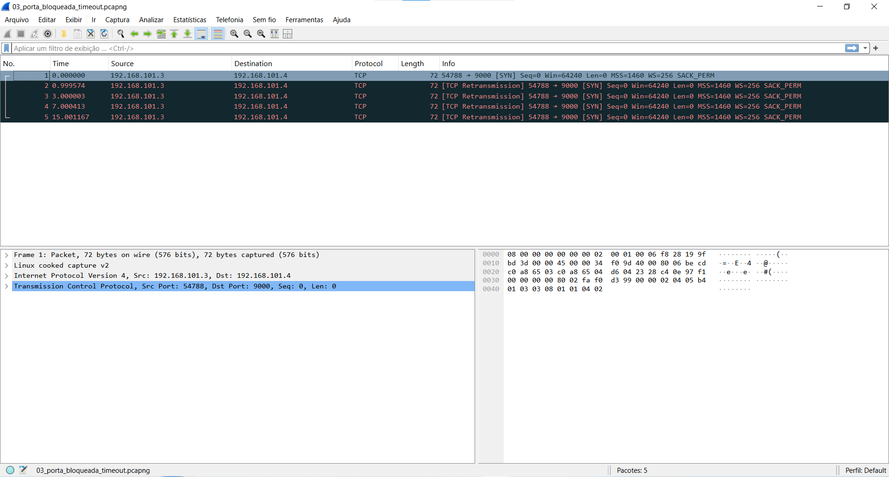

# 🔍 Análise de Tráfego TCP/IP: Portas Abertas, Fechadas e Bloqueadas por Firewall

## 📌 Visão Geral do Projeto
Este repositório contém a documentação prática e os arquivos de captura de tráfego (`.pcapng`) de um laboratório focado na análise do comportamento do protocolo TCP/IP nas camadas de Rede (L3) e Transporte (L4) do modelo OSI.

O objetivo do projeto é demonstrar e analisar visualmente as diferenças fundamentais entre conexões bem-sucedidas (*Three-Way Handshake*), tentativas em portas sem serviços ativos (*TCP Reset*) e bloqueios por regras de filtragem de pacotes (*Firewall DROP*).

---

## 🛠 Topologia e Ambiente de Testes
* **Cliente (Host):** Windows 11 (`192.168.101.3`)
* **Servidor (VM):** Ubuntu Server 24.04 LTS (`192.168.101.4`)
* **Ferramentas Utilizadas:**
  * `tcpdump`: Captura de tráfego de rede via linha de comando no Linux.
  * `Wireshark`: Análise detalhada dos pacotes, flags TCP e tempos de retransmissão.
  * `PowerShell (Test-NetConnection)`: Geração sintética de tráfego TCP direcionado a portas específicas.
  * `Docker / Docker Compose`: Orquestração do serviço Nginx de teste.
  * `iptables`: Configuração de regras de firewall de filtragem de pacotes.

---

## 🧪 Cenários Analisados

### 1. Conexão Bem-Sucedida (Porta Aberta - 8080/TCP)
* **Comportamento:** O serviço Nginx está ativo no container Docker escutando a porta `8080/TCP`. A conexão é estabelecida através do handshake completo de 3 vias.
* **Sequência de Flags:** `SYN` ➔ `SYN, ACK` ➔ `ACK`.



* **Análise Técnica:**
  1. O cliente envia o pacote `[SYN]` solicitando a abertura de sessão.
  2. O servidor responde com `[SYN, ACK]`, confirmando a disponibilidade da porta e do serviço.
  3. O cliente responde com `[ACK]`, finalizando o estabelecimento do socket TCP para iniciar a troca de dados.

---

### 2. Porta Fechada Sem Firewall (7777/TCP)
* **Comportamento:** Não há nenhum serviço rodando na porta `7777/TCP`, e nenhuma regra de firewall está ativa para bloquear o tráfego.
* **Sequência de Flags:** `SYN` ➔ `RST, ACK`.



* **Análise Técnica:**
  1. O cliente envia o pacote `[SYN]`.
  2. Como a porta não possui socket aberto, a pilha de rede do Linux rejeita a conexão enviando **imediatamente** um pacote `[RST, ACK]` (Reset).

---

### 3. Porta Bloqueada por Firewall (9000/TCP - Regra DROP)
* **Comportamento:** O tráfego para a porta `9000/TCP` é interceptado por uma regra `DROP` no `iptables`. Os pacotes de entrada são descartados silenciosamente.
* **Sequência de Flags:** `SYN` ➔ *(Sem Resposta)* ➔ `TCP Retransmission` (Timeout).



* **Análise Técnica:**
  1. O cliente envia o pacote `[SYN]`.
  2. O firewall descarta o pacote na cadeia `INPUT` sem gerar qualquer notificação de erro ou recusa.
  3. Sem receber confirmação (`ACK`), o cliente entra em loop de retransmissão exponencial (intervalos crescentes) até atingir o limite de tempo e retornar erro de *Timeout*.

---

---

---

## 📊 Conclusões Chave

* **Diferença entre Fechada e Bloqueada:** Portas fechadas respondem ativamente com `RST` em milissegundos, enquanto portas bloqueadas por filtros `DROP` ignoram os pacotes, forçando retransmissões no cliente e resultando em estouro de *timeout*.
* **Diagnóstico de Redes:** A análise visual via Wireshark permite identificar rapidamente problemas de conectividade, diferenciando falhas de aplicação (servidor fora do ar / porta fechada) de bloqueios por infraestrutura/segurança (firewall / ACLs).

## 💻 Como Reproduzir o Laboratório

### 1. Subir o Serviço de Teste (Servidor)
No diretório do projeto no Ubuntu Server, execute:
```bash
sudo docker compose up -d
